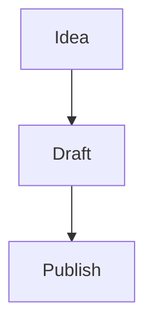

# Blog Authoring Guide

The blog lives inside this repo and publishes under `/blog`.

There is also a local helper page at `/blog/new` for faster authoring with:

- `Visual` mode for normal writing and toolbar actions
- `Markdown` mode for direct source editing
- drag and drop image support inside the editor
- generated Markdown output ready to save

## Content workflow

1. Create a new Markdown file in `src/content/blog/`.
2. Use a kebab-case filename. That filename becomes the URL slug.
3. Add frontmatter for the post metadata.
4. Write the body in Markdown.
5. Put any images in `public/blog-assets/<slug>/`.
6. Either reference images with absolute paths such as `/blog-assets/<slug>/cover.jpg`, or set `mediaSubpath` and use relative names like `cover.jpg`.
7. Run `npm run dev` and preview the post locally at `/blog/<slug>`.

## Faster UI workflow

1. Start the site locally with `npm run dev`.
2. Open `/blog/new`.
3. Fill in the metadata form.
4. Write in `Visual` mode or `Markdown` mode.
5. Use the toolbar for bold, headings, lists, links, quotes, and code.
6. Use `Copy Markdown` or `Download file`.
7. Save that output into `src/content/blog/<slug>.md`.
8. Put images in `public/blog-assets/<slug>/`.

This helper is intentionally local-first. It does not write files directly into the repo from the browser.

## Easiest image workflow

Inside `/blog/new`:

1. Drag an image directly into the editor, or click `Select images`.
2. The image appears immediately inside the editor for local preview.
3. The side panel shows the same image with its final asset path.
4. Use `Use as cover` if one of the uploaded images should become the post cover.
5. If your browser supports folder access, click `Save images to assets folder` and choose `public/blog-assets/<slug>/`.
6. Save the Markdown file with `Save markdown to content folder` or use the copy/download fallback.

This keeps image paths predictable and avoids manually typing image references.

## Frontmatter fields

```md
---
title: Your title
excerpt: One short summary used in cards and metadata
description: Optional override for article subtitle and SEO
date: 2026-04-05
updatedDate: 2026-04-06 # optional
categories:
  - Writing
  - Tutorial
tags:
  - 3D Printing
  - Practical Builds
author: alex # optional, defaults to alex
# or:
authors:
  - alex
image:
  path: cover.jpg
  alt: Short alt text for the cover image
mediaSubpath: /blog-assets/your-slug # optional but recommended
pin: false # optional
toc: true # optional
comments: true # optional
math: false # optional
mermaid: false # optional
draft: false # optional
featured: false # optional
---
```

## Drafts

Set `draft: true` and the post will stay out of the published listing and routes.

## Images and Media

- Create a folder per post in `public/blog-assets/<slug>/`.
- Prefer `mediaSubpath: /blog-assets/<slug>` in frontmatter.
- Use `image.path` for the main card and social preview image.
- Use normal Markdown images in the body:

```md

```

- For captioned images, write an italic line immediately after the image:

```md

_Short caption here._
```

- If you want explicit layout classes such as left/right/shadow, use HTML:

```html
<figure class="blog-figure is-right has-shadow">
  
  <figcaption>Optional caption.</figcaption>
</figure>
```

For theme-specific variants:

```html


```

## Callouts

Use GitHub-style markers inside blockquotes:

```md
> [!INFO]
> This is an informational callout.
```

Supported markers:
- `NOTE`
- `INFO`
- `TIP`
- `WARNING`
- `CAUTION`
- `DANGER`

## Video and audio embeds

Markdown supports raw HTML, so you can embed a video or external demo with a plain iframe:

```html
<div style="position:relative;padding-top:56.25%;margin:2rem 0;">
  <iframe
    src="https://www.youtube.com/embed/VIDEO_ID"
    title="YouTube video player"
    allow="accelerometer; autoplay; clipboard-write; encrypted-media; gyroscope; picture-in-picture; web-share"
    allowfullscreen
    style="position:absolute;inset:0;width:100%;height:100%;border:0;border-radius:1rem;"
  ></iframe>
</div>
```

For now, prefer raw HTML embeds in posts. It is explicit, reliable, and already styled by the blog.

## Code blocks

Standard fenced Markdown code blocks work out of the box:

```ts
console.log("hello");
```

## Mermaid

Enable Mermaid for a post:

```md
---
mermaid: true
---
```

Then use:

~~~md

~~~

## Math

Enable KaTeX rendering:

```md
---
math: true
---
```

Inline math:

```md
The usual form is $E = mc^2$ in a sentence.
```

Block math:

```md
$$
\int_0^1 x^2 dx = \frac{1}{3}
$$
```

## Local preview

```bash
npm install
npm run dev
```

Then open `http://localhost:4321/blog`.

## Comments

Comments are wired for optional Giscus support. Configure them in:

- `src/data/blog-config.ts`

If `comments: false` is set in frontmatter, the comments block is hidden for that post.

## Post template

Use [`docs/blog-post-template.md`](./blog-post-template.md) as the starting point for a new article.
