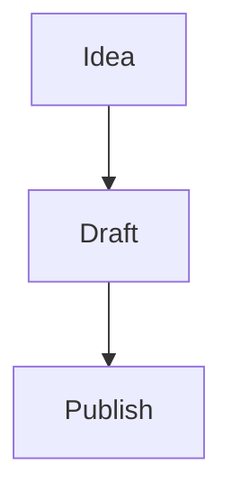

Start with a direct intro paragraph. Short posts look good here, so do not force length.

## What this is

Explain the idea, build, experiment, or note.

_Add a caption only if it helps._

## What changed

- Mention the useful decisions
- Keep the details practical
- Link out only when it improves the post

> [!TIP]
> Use prompt markers like `TIP`, `INFO`, `WARNING`, or `DANGER` for callouts.

## Closing note

Add a short conclusion or next step.
