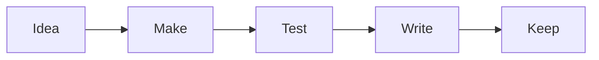

Hi. I'm Alex.

I'm a software engineer, and a father of two.

This is the big picture: I like to create. Sometimes that means software. Sometimes that means physical things.

I also helped most of my life with my father's work. He is an artist. He makes designs by hand, with pen and paper, and I often helped translate them into vector drawings, usually in CorelDRAW.

So I guess that is part of why I was attracted to software in the first place. I liked the idea of building things.

And that is probably also why I eventually got a 3D printer.

I like making things that are useful, or at least interesting enough to be worth keeping.

That is more or less what I want this blog to be about too.

## What this blog is for

I will try to keep this place about what I like and what I am doing.

That probably means:

- software
- practical systems
- 3D printing
- small household fixes
- work notes when they are concrete enough to matter

If something feels fake, overexplained, or written just to fill space, I would rather not publish it.

> [!INFO]
> Plain text, good structure, and a few clear images are usually enough for a useful post.

## Why this page also exists as a demo

This page is also for me.

I want one post where I can quickly see examples of what I can do on this blog: formatting blocks, code snippets, embeds, image layouts, and a few other tools that are useful when writing future posts.

So yes, this page is partly an introduction, but it is also a reference.

> [!TIP]
> If a future post needs a pattern I already used here, I can just come back, copy the shape, and move on.

## A small code block

Sometimes a code block is the clearest way to show a thought.

```ts
type ThingIWantToBuild = {
  kind: "software" | "physical";
  worthKeeping: boolean;
};

export function shouldDocument(it: ThingIWantToBuild) {
  return it.worthKeeping;
}
```

And sometimes inline code is enough, like `mediaSubpath`, `draft: true`, or a simple route such as `/blog`.

> [!WARNING]
> The point is not to make every post look fancy. The point is to make useful posts easy to write.

## A simple diagram

I do not expect to use diagrams often, but if I need one, I want to know it works.



## Links and embeds

Normal links should stay clean and easy to read, whether they go to the [blog index](/blog), the [archive](/blog/archive), or a specific post like [the kitchen curtain rod build](/blog/kitchen-curtain-rod-3d-printed-holders).

If I want to include a video, embeds should work too:

<figure class="embed-card">
  <div class="embed-frame">
    <iframe
      src="https://www.youtube.com/embed/6GSqfURNOa4"
      title="Example YouTube embed"
      allow="accelerometer; autoplay; clipboard-write; encrypted-media; gyroscope; picture-in-picture; web-share"
      allowfullscreen
    ></iframe>
  </div>
  <figcaption>A simple embed example.</figcaption>
</figure>

## Images and grouped visuals

Sometimes I will want one image. Sometimes I will want a grouped layout.

<figure class="blog-gallery">
  <div class="blog-gallery__grid">
    
    
  </div>
  <figcaption>A small gallery example with two related images.</figcaption>
</figure>

## Final note

So this page is more or less for me.

But I keep it public because it is easy to access, and because it still says something real about what I am trying to do here.

Thank you for your visit.
