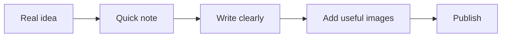

I am Alex Nutu. I am a software engineer, a husband, and a father of two.

Most of the time I am interested in practical things: software that is actually useful, systems that stay understandable, 3D printing when it solves a real problem, and small improvements that are worth documenting once and reusing later.

This post is also the reference article for the blog itself. So instead of filling it with vague filler, I want it to do two jobs at once: say who I am, and show the kinds of content blocks this blog supports.

## Who I am

I like solving problems and building user-friendly solutions.

I currently work at Lenovo, where I moved into a scrum master role after spending time learning, shipping, and improving things through actual work. Before that, I worked at SAP from 2017 to 2020, where I started my first programming job as a back-end developer.

That background still shapes how I look at things now. I care about software, but I also care about clarity, process, and whether something is actually helpful once real people start using it.

<figure class="blog-figure is-narrow">
  
  <figcaption>Me, outside the terminal.</figcaption>
</figure>

## What tends to show up here

This blog is not meant to be a content machine.

It is for notes that are worth keeping:

- practical software lessons
- 3D printing projects that solve something real
- work notes when they are concrete enough to be useful
- small household builds and fixes
- occasional writing about structure, learning, and responsibility

If something feels too generic, too performative, or too polished without saying anything, it probably does not belong here.

## A few things I want this blog to support

I want writing here to stay simple, but I still want a few richer blocks when they help.

> [!INFO]
> The default should always be plain text and clean images. Richer blocks are for the cases where they actually clarify something.

> [!TIP]
> If a post can be useful with one image, a few paragraphs, and a conclusion, that is usually enough.

> [!WARNING]
> Fancy formatting is easy to overuse. If everything is emphasized, nothing is emphasized.

## A short code example

Even when a post is not deeply technical, I still want code blocks to look good when I need them.

```ts
type Note = {
  topic: "software" | "maker" | "life";
  worthKeeping: boolean;
};

export function shouldBecomePost(note: Note) {
  return note.worthKeeping;
}
```

Inline code should also stay readable, whether it is `mediaSubpath`, `draft: true`, or a path like `/blog`.

## A simple workflow diagram

Sometimes a tiny diagram explains the process faster than a paragraph.



## Links and embeds

Normal links should stay quiet and readable, whether they point back to the [blog index](/blog), to the [archive](/blog/archive), or to a specific build like [the kitchen curtain rod post](/blog/kitchen-curtain-rod-3d-printed-holders).

If I need a video, embeds should also work without making the page feel heavy:

<figure class="embed-card">
  <div class="embed-frame">
    <iframe
      src="https://www.youtube.com/embed/6GSqfURNOa4"
      title="Example YouTube embed"
      allow="accelerometer; autoplay; clipboard-write; encrypted-media; gyroscope; picture-in-picture; web-share"
      allowfullscreen
    ></iframe>
  </div>
  <figcaption>A simple YouTube embed for when a link alone is not enough.</figcaption>
</figure>

## Images and grouped visuals

Single images should look clean. If there are two related images, a grouped layout is useful.

<figure class="blog-gallery">
  <div class="blog-gallery__grid">
    
    
  </div>
  <figcaption>One design-stage image and one finished result.</figcaption>
</figure>

## Why I am keeping it like this

I do not want a giant content system just to write a useful note.

For me, the right setup is still a local Markdown workflow with clean frontmatter, predictable image paths, and just enough components to handle real-world posts without friction.

That is what this blog is meant to be: personal, practical, and easy to keep honest.
