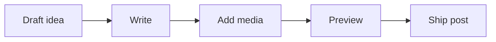

This post exists mostly as a working reference for the blog itself.

Instead of pretending to be a normal article, it is meant to show what the current setup can handle cleanly: text, images, captions, callouts, code, Mermaid diagrams, embeds, galleries, links, and a few richer content patterns that should still feel readable.

If I need to remember later what the system supports, this is the post I can come back to.

## What this article is for

It is useful to have one post that is obviously a demo.

That means I can test:

- long-form paragraphs
- standard images
- figure captions
- info, warning, and tip callouts
- code blocks
- Mermaid diagrams
- YouTube embeds
- galleries
- link styling

The point is not to make this beautiful literature. The point is to make the blog easier to evolve without guessing.


_A calm setup matters more when time is fragmented and attention is expensive._

## Paragraphs and normal reading flow

This is a normal paragraph block. It should read comfortably, wrap well, and keep a calm rhythm on both desktop and mobile.

This is also where links should feel natural, like [opening the archive](/blog/archive), [going back to the blog index](/blog), or linking to an external reference such as [YouTube](https://www.youtube.com/watch?v=6GSqfURNOa4) without visually breaking the page.


_This uses a shared image from `/public/static`, useful when an asset is not specific to one post folder._

## Callouts and prompts

> [!INFO]
> Use `INFO` when something is clarifying and should stand out without sounding alarming.

> [!WARNING]
> Use `WARNING` when something is easy to misuse or likely to create confusion.

> [!TIP]
> Use `TIP` when there is a practical shortcut, better workflow, or small recommendation worth calling out.

## Lists and simple structure

I try to keep three things true:

- the next task is small enough to finish in one sitting
- the project state is obvious when I reopen it
- the notes explain what I should do next, not what I already know

That is enough for most posts. The useful test is whether the article still feels clear when it mixes prose and structure.

## Code blocks

Code should stay readable and visually distinct without becoming the loudest thing on the page.

```ts
type EveningSession = {
  energy: "low" | "medium" | "high";
  minutes: number;
};

export function pickTask(session: EveningSession) {
  if (session.minutes < 30) return "notes-or-cleanup";
  if (session.energy === "low") return "editing-or-refactor";
  return "new-work";
}
```

Inline code should also stay calm, like `n / s`, `mediaSubpath`, or `draft: true`.

## Mermaid diagrams

Mermaid is useful when a small diagram explains the structure faster than a paragraph.



## Embedded YouTube

The editor preview should handle rich embeds more gracefully, especially when the content is already pasted in.

Here is a direct embed block:

<figure class="embed-card">
  <div class="embed-frame">
    <iframe
      src="https://www.youtube.com/embed/6GSqfURNOa4"
      title="YouTube embed demo"
      allow="accelerometer; autoplay; clipboard-write; encrypted-media; gyroscope; picture-in-picture; web-share"
      allowfullscreen
    ></iframe>
  </div>
  <figcaption>Embedded YouTube should look intentional, not bolted on.</figcaption>
</figure>

And here is the plain link version the editor should also recognize better in preview:

https://www.youtube.com/watch?v=6GSqfURNOa4

## Galleries and grouped visuals

Sometimes one image is enough. Sometimes a grouped layout reads better.

<figure class="blog-gallery">
  <div class="blog-gallery__grid">
    
    
  </div>
  <figcaption>Two visuals side by side, using the same article assets folder.</figcaption>
</figure>

## Closing note

This is not meant to be the deepest post on the site. It is the capabilities article.

If I need to test formatting, spacing, media, or preview behavior later, this should be the first place to look.
