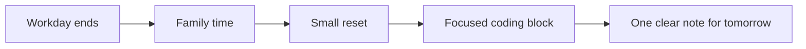

Writing after the kids are asleep is a very different kind of work from the kind I used to imagine when I thought about productivity. The useful unit is no longer a perfect afternoon. It is one quiet hour with a clear edge, low friction, and zero drama about what did not fit.

That constraint can make work feel smaller, but it can also make it cleaner. You stop pretending that every session is going to change your life and start building systems that survive interruption.


_A calm setup matters more when time is fragmented and attention is expensive._

## The rhythm is different now

Before kids, it was easier to brute-force progress with time. After kids, progress depends more on recovery speed. If I only have forty-five minutes, I cannot spend fifteen of them remembering what I meant three days ago.

> [!INFO]
> The problem is not just less time. The bigger problem is higher restart cost.

That changes the ideal shape of side projects, writing, and even learning. Smaller loops win more often than larger ambitions.

## A useful default

I try to keep three things true:

- the next task is small enough to finish in one sitting
- the project state is obvious when I reopen it
- the notes explain what I should do next, not what I already know

> [!WARNING]
> If the next step requires “getting back into the whole system first,” it is probably too large for the life you actually have.

## The tiny system that helps

The best version of a system is boring. It should reduce decision cost, not create a second hobby around managing your workflow.

```ts
type EveningSession = {
  energy: "low" | "medium" | "high";
  minutes: number;
};

export function pickTask(session: EveningSession) {
  if (session.minutes < 30) return "notes-or-cleanup";
  if (session.energy === "low") return "editing-or-refactor";
  return "new-work";
}
```

That snippet is simple on purpose. A usable routine usually looks less clever than the thing it protects.

## Where the friction actually is

The hard part is usually not writing code. It is switching context while still carrying the emotional residue of the day.

> [!TIP]
> If you want more consistent evenings, reduce transition friction before you optimize output.

For me, that means opening the same windows, the same notes, and the same local preview path every time. Familiarity is a performance feature.

## A quick visual model



The point is not to preserve long uninterrupted flow. The point is to preserve re-entry.

## Expectations need simple math too

Sometimes the best estimate is not emotional at all. If a project needs `n` focused sessions and the average week only gives you `s`, then the real timeline is closer to `weeks = n / s`.

That is obvious on paper, but surprisingly easy to ignore in real life.

## Media and embeds still matter

The blog can also handle richer media when it helps the post instead of decorating it.

<div class="embed-card">
  <div class="embed-frame">
    <iframe
      src="https://www.youtube.com/embed/H-B46URT4mg"
      title="YouTube embed example"
      allow="accelerometer; autoplay; clipboard-write; encrypted-media; gyroscope; picture-in-picture; web-share"
      allowfullscreen
    ></iframe>
  </div>
</div>

The useful rule is simple: add media only when it compresses explanation.

## Closing note

Life with kids does not make thoughtful work impossible. It just punishes vagueness faster. If the system is calm, the scope is honest, and the re-entry cost is low, even a short block of time can still produce something real.
